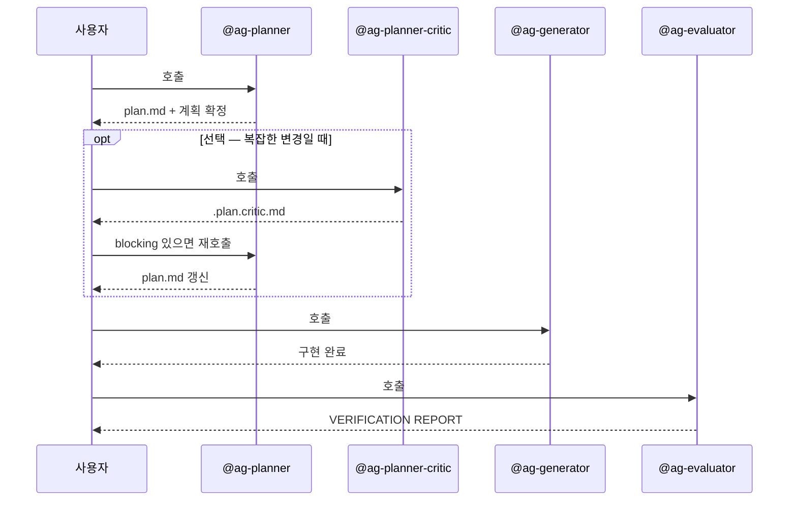

# 에이전트 흐름

dp-skills 의 5개 에이전트가 누구이고, 언제 호출되는지입니다.

## 사이클 안의 4개 + 사이클 밖의 1개

| 에이전트 | 호출 | 역할 |
|---|---|---|
| **Planner** | `@ag-planner` | 요구사항 분석 + 영향 범위 + 계획 수립 → `plan.md` 저장 |
| **Planner-Critic** | `@ag-planner-critic` | (선택) `plan.md` 를 adversarial 시각으로 챌린지 → `.plan.critic.md` |
| **Generator** | `@ag-generator` | 계획대로 구현 + 제출 전 sanity check |
| **Evaluator** | `@ag-evaluator` | 완성도 심사 + 체크리스트 평가 (사이클 안, feature 단위) |
| **Code-Reviewer** | `@ag-code-reviewer` | PR 직전 셀프 리뷰 (사이클 밖, 슬래시 진입 없음) |

## 호출 순서



핵심 규칙:

- **순서 엄수.** 이전 단계 완료 전 다음 단계로 가지 않습니다.
- 각 에이전트는 사용자가 **명시 호출** 합니다. **자동 파이프라인이 없습니다** — phase 사이에 멈추고 개입할 수 있습니다.
- `@ag-planner-critic` 은 planner 와 generator 사이의 **선택적** 단계입니다. trivial 한 변경에서는 스킵합니다.

미완료 feature 전체에 이 사이클을 **순차 자동** 적용하려면 [`/dp-skills:run-cycle`](../reference/skills/run-cycle.md) 을 씁니다 — 수동 체이닝을 대신하되 plan 승인·critic blocking·`NOT_READY` 게이트에서는 멈춥니다.

> evaluator 는 심사를 마친 뒤, 이번 변경이 팀 도메인 지식 문서(`context/`)에 남길 신규·변경 지식을 만들었는지도 판정해 **환류** 를 제안합니다 (gate 아님 — `READY` 와 공존). 자세히는 [도메인 지식 환류](../how-to/knowledge-sync.md).

## 사이클 밖 — code-reviewer

```text
사이클 밖 (PR 전): @ag-code-reviewer [--base <branch>] → CODE REVIEW REPORT → /dp-skills:pr
```

`@ag-code-reviewer` 는 사이클 흐름과 무관하게 PR 단위로 호출합니다. 사이클 안 4개 wrapper 는 `tools/orchestrate-load.py` 로 컨텍스트를 자동 로드하지만, code-reviewer 는 self-contained 라 git diff·언어 감지·룰 파일을 자체 로드합니다 (슬래시 진입점 없음).

## 검토자 3종의 책임 경계

critic·evaluator·code-reviewer 모두 검토자지만 대상이 다릅니다.

| 검토자 | 대상 | 시점 |
|---|---|---|
| `@ag-planner-critic` | 작성된 *계획* (`plan.md`) | 구현 **전** |
| `@ag-evaluator` | feature plan 대비 *구현 충족*·TDD 증거·테스트 | 구현 **직후** (사이클 안) |
| `@ag-code-reviewer` | 누적 *코드 변경* (git diff) — cross-cutting 일관성·언어 규약·hunk 디테일 | PR **직전** (사이클 밖) |

code-reviewer 는 evaluator 영역(요구사항·TDD 증거·테스트 실행)을 **절대 다루지 않습니다**. 반대로 cross-cutting 일관성·언어 규약·누락 마무리는 code-reviewer 전담입니다.

## 다음 단계

- How-to: [Critic 으로 계획 챌린지](../how-to/critic-review.md) · [PR 직전 셀프 코드 리뷰](../how-to/self-code-review.md)
- Explanation: [모드](modes.md) — 모드별 에이전트 책임 확장
- Reference: [Agents 목록](../reference/agents/index.md)
