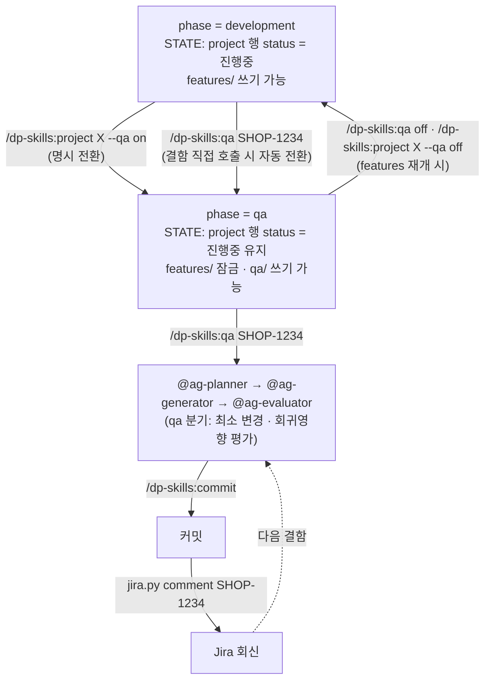

# Lifecycle phases — development / qa

project 는 두 개의 phase 를 갖습니다 — **development** (기능을 만드는 단계) 와 **qa** (이미 만든 기능의 결함을 처리하는 단계). 같은 컨텍스트 (`features/`·`scope/`·`rules/`·`agents/`) 를 이어쓰면서, 단계에 따라 에이전트의 책임만 달라집니다.

!!! info "phase 와 mode 는 직교한다"
    phase 는 *작업 단계* (지금 무엇을 하고 있나), mode 는 *사이클 동작 방식* (어떻게 진행하나). qa phase 안에서도 TDD/Characterize 모드는 그대로 켜고 끌 수 있습니다. 모드 자체에 대한 설명은 [모드 — Standard / TDD / Characterize](modes.md) 참조.

## 설계 전제

- **여러 project 가 동시에 QA phase 일 수 있다.** 단, 한 turn 은 한 project 만 활성입니다 — `/dp-skills:project X` 로 명시 전환합니다. `/dp-skills:qa` 는 현재 활성 project 의 `qa/` 에만 작성합니다.
- **다건 추적의 SSOT 는 Jira.** 잔여 결함·우선순위·재오픈 현황은 Jira UI/board 에서 확인합니다. 본 플러그인은 **건 1개 처리** 에만 책임집니다 — 로컬 보드뷰·INDEX·진행 요약 카운트를 만들지 않습니다 (SSOT 이중화 회피).
- **회신은 Jira-only.** `tools/jira.py comment` 가 Jira 에 코멘트를 송신하고 끝납니다. 로컬 `qa/{KEY}.md` 에는 회신 섹션이 없습니다.
- **phase 전환은 project 또는 qa 스킬로.** `/dp-skills:project {PROJECT} --qa on|off` 로 명시 전환하거나, `/dp-skills:qa {KEY}` 를 development phase 에서 직접 호출하면 qa phase 로 자동 전환됩니다 (`.agent-state.yml` 의 `phase` 필드만 갱신 — STATE.md status 는 건드리지 않음). qa phase 탈출은 `/dp-skills:qa off` 또는 `/dp-skills:project {PROJECT} --qa off`.

## 두 phase 의 책임 차이

| phase | 무엇을 하는가 | 산출 위치 | features/ |
|---|---|---|---|
| **development** (기본) | 기획서·프롬프트 → features/ → 구현 | `features/`·`agents/`·구현 코드 | **쓰기 가능** |
| **qa** | Jira 결함 1건 분석·국소 수정·회신 | `qa/{KEY}.md` (분석·조치·회귀영향만) | **읽기 전용** — hook 가 차단 |

phase 는 `.agent-state.yml` 의 `phase` 필드로 표현됩니다 (default `development`) — 이것이 phase 의 단일 SSOT 입니다. STATE.md 의 활성 project 행 status 칸은 phase 를 비추지 않으며, qa phase 에서도 `진행중` 을 유지합니다 (status 는 project 생명주기 표시 전용).

## 전환 흐름

전환 시 바뀌는 것:

- `.agent-state.yml` 의 `phase` 필드 (`development` ↔ `qa`) — phase 의 단일 SSOT. (`STATE.md` status 칸은 바뀌지 않습니다 — 항상 `진행중`.)
- agents wrapper 의 분기 — planner/generator/evaluator 가 `phase == qa` 블록을 추가로 읽습니다.
- hook 의 features/ 쓰기 잠금 — `phase: qa` 에서 features/ 본문 수정이 차단됩니다.

## 에이전트의 phase 별 책임

같은 에이전트가 phase 에 따라 다르게 동작합니다 — wrapper 가 `.agent-state.yml` 의 `phase` 필드를 읽어 프롬프트 분기를 적용합니다.

| 에이전트 | development | qa 분기 추가 |
|---|---|---|
| `@ag-planner` | 구현 계획 | **결함 수정 모드** — 최소 변경 우선, 신규 추상화·리팩터 제안 금지, 회귀영향 후보 파일 명시 |
| `@ag-generator` | 코드 구현 | **결함 지점 국소 수정** — 동일 함수 외 변경 금지, features/ 본문 수정 금지 (hook 차단) |
| `@ag-evaluator` | 체크리스트 | **회귀영향 평가 섹션 필수** — 동일 호출 경로를 쓰는 feature 명단·영향 판단 포함 |

phase 는 mode 와 직교하므로, qa phase 에서 TDD 모드를 함께 켜면 결함 재현 테스트를 먼저 작성한 뒤(Red) 국소 수정으로 통과시키는(Green) 사이클이 됩니다.

## QA 가 선택적인 이유

기획·구현이 끝나도 QA 가 결함을 보고하지 않는 project 는 QA phase 로 전환할 필요가 없습니다. development 만으로 lifecycle 이 종료되며, 후에 QA 결함이 들어오면 그때 `--qa on` 으로 전환합니다. phase=qa 에서 `/dp-skills:qa off` (또는 `--qa off`) 로 development 로 되돌릴 수도 있어, 회귀 sprint 등 양방향 전환이 가능합니다.

운영 장애·핫픽스처럼 project 컨텍스트가 필요 없는 단발 처리는 [`/dp-skills:issue`](../reference/skills/issue.md) 가 담당합니다 — QA phase 와 issue 모드는 공존합니다.

## 다음 단계

- How-to: [QA 사이클 진행](../how-to/qa-cycle.md) — 절차 5분 분량.
- Reference: [`/dp-skills:qa`](../reference/skills/qa.md) · [`/dp-skills:project`](../reference/skills/project.md) · [`jira.py`](../reference/tools/jira.md)
- Explanation: [모드 — Standard / TDD / Characterize](modes.md) · [Workspace 레이아웃](workspace-layout.md)
