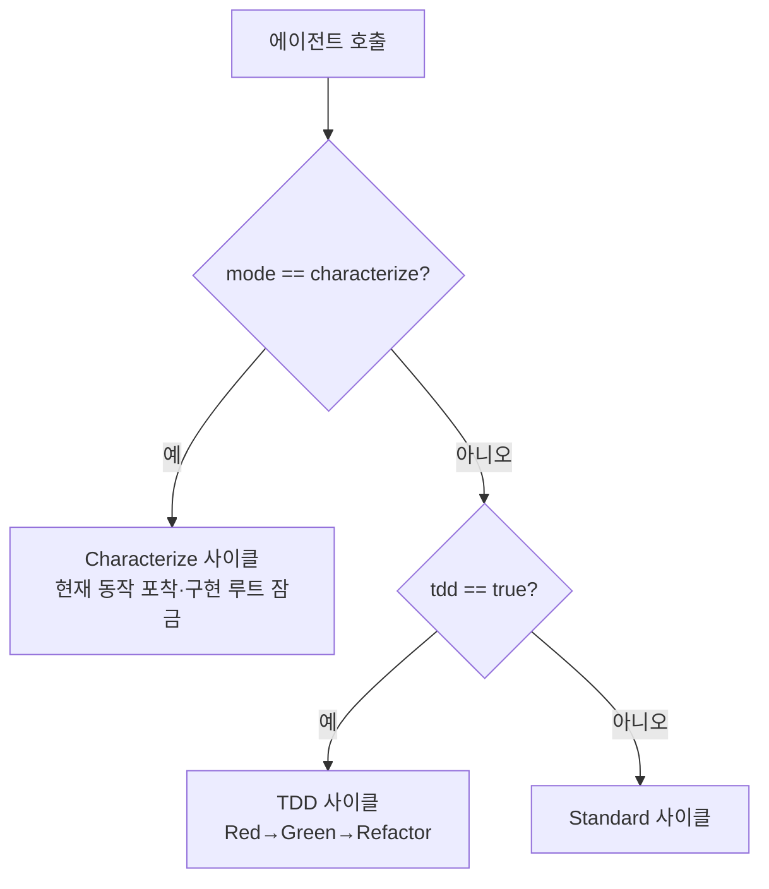

# 모드 — Standard / TDD / Characterize

dp-skills 의 사이클은 3개 모드로 동작합니다. 어느 모드인지에 따라 같은 에이전트의 책임이 달라집니다.

## phase 와 mode 의 차이

**phase 와 mode 는 직교** 합니다 — qa phase 안에서 TDD 모드를 함께 켤 수 있고, development phase 에서 Characterize 모드를 쓸 수도 있습니다. 두 축은 표현 위치도 다릅니다.

| 축 | 값 | 표현 위치 |
|---|---|---|
| **phase** | `development` (기본) · `qa` | `.agent-state.yml` 의 `phase` |
| **mode** | `standard` · `tdd` · `characterize` | `.agent-state.yml` 의 `tdd`·`mode` |

phase 는 **작업 단계** (지금 무엇을 하고 있나), mode 는 **사이클 동작 방식** (어떻게 진행하나). 본 페이지는 mode 만 다룹니다 — phase 개념과 development/qa 전환은 [Lifecycle phases — development / qa](lifecycle-phases.md) 에서 다룹니다.

## 세 모드

| 모드 | 무엇을 위한 것 | 토글 |
|---|---|---|
| **Standard** | 일반 기능 구현 | 기본값 |
| **TDD** | 새 동작을 테스트 우선으로 — Red→Green→Refactor | `/dp-skills:project --tdd` 또는 `/dp-skills:tdd` |
| **Characterize** | 레거시 코드의 *현재 동작* 을 spec 으로 포착 | `/dp-skills:characterize on` |

모드는 `.agent-state.yml` 의 `tdd`·`mode` 필드로 표현됩니다.

## 진입 분기

`tdd: true` 와 `mode: characterize` 가 동시에 설정되면 **characterize 가 우선** 합니다 — Red 계약 대신 Characterization Contract 가 적용됩니다.

## 에이전트 책임의 모드별 확장

같은 에이전트라도 모드에 따라 하는 일이 다릅니다.

| 에이전트 | Standard | TDD | Characterize |
|---|---|---|---|
| `@ag-planner` | 구현 계획 | + 스텝 분할 + 실패 테스트 (Red) | **Characterization Contract** (관찰된 입출력) |
| `@ag-generator` | 코드 구현 | + 최소 구현 (Green) | **`{source_root}` 잠금** — spec 만 추가 |
| `@ag-evaluator` | 체크리스트 | + 변경 관련 테스트만 실행 | 구현 수정 감지 시 반려, spec 정확도 검증 |

## TDD 와 Characterize 의 결정적 차이

둘 다 테스트를 다루지만 방향이 반대입니다.

- **TDD** — *바뀌어야 할 동작* 을 먼저 테스트로 정의하고(Red), 그걸 통과시키는 구현을 만듭니다(Green).
- **Characterize** — *지금 그대로의 동작* 을 테스트로 고정합니다. 구현은 건드리지 않습니다. 리팩터는 모드를 끈 별도 사이클에서 합니다.

테스트 없는 레거시 코드를 안전하게 만들려면 characterize 로 현재 동작을 먼저 고정한 뒤, 모드를 끄고 TDD/Standard 로 리팩터하는 순서가 자연스럽습니다.

## 다음 단계

- How-to: [TDD 모드 활성화](../how-to/tdd-mode.md) · [Characterize 모드](../how-to/characterize-mode.md)
- Explanation: [Lifecycle phases — development / qa](lifecycle-phases.md) · [에이전트 흐름](agent-flow.md)
