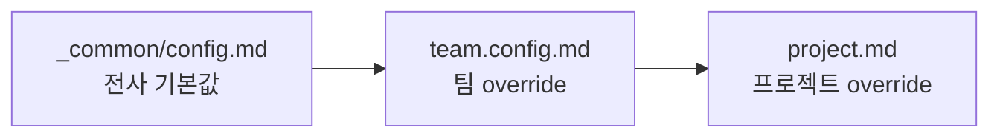

# 워크스페이스 설정

도메인 지식(`MANIFEST`·`scope`·`rules`) 말고도, 팀이 채워야 하는 **런타임 설정·컨벤션 파일** 이 있습니다. 어디에 무엇을 두는지 정리합니다.

## `_common/` vs `{TEAM}/context/`

`workspace/` 안에는 설정이 두 레이어로 나뉩니다.

| 레이어 | 경로 | 성격 | 누가 쓰나 |
|---|---|---|---|
| 전사 공통 | `workspace/_common/` | 모든 팀이 공유하는 기본값 | 다중 팀 환경에서 수동 구성 |
| 팀 특화 | `workspace/{TEAM}/context/` | 한 팀의 설정·도메인 지식 | `/dp-skills:team-init` 가 스켈레톤 생성 |

경계는 단순합니다 — **여러 팀이 같이 쓸 값이면 `_common/`, 한 팀 것이면 `{TEAM}/context/`.** 팀이 하나뿐인 워크스페이스라면 `_common/` 을 거의 안 쓰고 `{TEAM}/context/` 만으로도 충분합니다.

## 설정 파일 2종류

워크스페이스 파일은 플러그인이 다루는 방식에 따라 두 부류로 갈립니다. 이 구분이 중요합니다.

### 1. 고정 스키마 — 플러그인이 *파싱* 한다

| 파일 | 담는 것 |
|---|---|
| `_common/config.md` | 전사 toolchain 기본값 (`## 언어·도구 기본값` 표) |
| `{TEAM}/context/team.config.md` | 팀 `## Ignore` · `## 팀 설정` · 언어·도구 override |

표 헤더·키 이름이 **고정 스키마** 입니다 — 훅·스크립트가 정확히 그 형태로 파싱하므로 임의 키를 추가하면 읽히지 않습니다. 값만 팀이 채웁니다.

### 2. 산문 컨벤션 — 에이전트가 *자연어로 읽는다*

| 파일 | 담는 것 |
|---|---|
| `coding.md` | 언어·프레임워크 코딩 관행 (`conventions_doc` 가 가리킴) |
| `evals/coding.json` | 코드 검증 케이스 (`conventions_evals` 가 가리킴) |
| `code-review/{generic,rules,lang}.md` | 코드 리뷰 룰 |

이쪽은 고정 스키마가 아니라 에이전트가 읽고 따르는 참조 자료입니다. `MANIFEST.md`·`scope`·`rules` 도 이 부류 — 플러그인은 파싱하지 않고 에이전트가 자연어로 해석합니다.

## override 우선순위

같은 설정을 여러 레이어가 정의하면 **좁은 scope 가 이깁니다**.

- toolchain 키(`test_command` 등): `_common/config.md` → `team.config.md` → `project.md` 순으로 덮어쓰기
- 산문 컨벤션(`pr.md`·`coding.md` 등): `workspace/_common/{이름}.md` 가 있으면 플러그인 내장 default 를 완전 대체

즉 전사 기본값을 깔아 두고, 팀·프로젝트는 다른 점만 다시 선언하면 됩니다.

## 무엇을 어디에 두나

| 설정하려는 것 | 파일 | How-to |
|---|---|---|
| 언어·테스트 러너·소스 루트 | `_common/config.md` | [toolchain 설정](../how-to/configure-toolchain.md) |
| 팀이 다른 toolchain 을 쓸 때 | `team.config.md` (override 표) | [toolchain 설정](../how-to/configure-toolchain.md) |
| 탐색 제외 경로·커밋 scope | `team.config.md` (`## Ignore`·`## 팀 설정`) | [팀 부트스트랩](../how-to/team-bootstrap.md) |
| 도메인 정책·제약 | `{TEAM}/context/rules/{domain}.md` | [도메인 rules 작성](../how-to/write-domain-rules.md) |
| 코드 리뷰 룰 | `{_common,TEAM}/.../code-review/` | [셀프 코드 리뷰](../how-to/self-code-review.md) |

## 다음 단계

- How-to: [toolchain·언어 설정](../how-to/configure-toolchain.md)
- Explanation: [Workspace 레이아웃](workspace-layout.md) — 디렉토리 구조 전체
