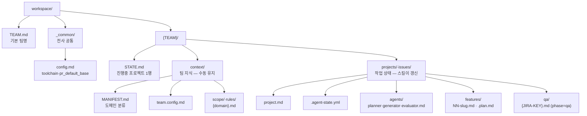

# Workspace 레이아웃

`workspace/` 어디에 무엇이 있는지 — 파일을 찾을 때 실제로 보는 페이지입니다.

## 전체 구조

`qa/` 폴더는 project 가 **phase=qa** 로 전환된 뒤 `/dp-skills:qa {KEY}` 첫 호출에서 lazy 생성됩니다. Jira 키 1개당 파일 1개 (`qa/QAPRJ-1234.md`), 회신 이력은 Jira 코멘트가 SSOT 이므로 로컬 파일에는 회신 섹션이 없습니다 — 자세한 내용은 [Lifecycle phases](lifecycle-phases.md) 참조.

## 두 개의 경계

레이아웃을 이해하는 핵심은 두 가지 경계입니다.

**1. 지식 저장소 vs 작업 상태**

- `_common/`·`context/` — 팀이 **손으로 유지** 하는 지식 저장소
- `projects/`·`issues/` — 스킬이 만들고 갱신하는 **작업 상태**

**2. 전사 공통 vs 팀 특화**

- `_common/` — 전사(다중 팀) 공통. 다중 팀 환경에서 수동 생성
- `{TEAM}/context/` — 팀별 특화

## 로드 순서·우선순위

같은 도메인·설정을 양쪽이 정의하면 **후순위가 우선** 합니다.

| 종류 | 로드 순서 (뒤가 우선) |
|---|---|
| MANIFEST | `_common/MANIFEST.md` → `{TEAM}/context/MANIFEST.md` |
| config | `_common/config.md` → `team.config.md` → `project.md` |

즉 팀 MANIFEST 가 전사 MANIFEST 를 override 하고, 프로젝트 설정이 팀·전사 설정을 override 합니다.

## 산문 컨벤션 fallback

`pr.md`·`coding.md` 같은 컨벤션 산문은 `workspace/_common/{이름}.md` 에 두면 플러그인 내장 default(`${CLAUDE_PLUGIN_ROOT}/skills/context/shared/{이름}.md`)를 **완전 대체** 합니다. 팀별 override 는 두지 않습니다 — PR 템플릿·코딩 컨벤션은 보통 레포지터리 단위라 워크스페이스 공통이 자연스럽습니다.

## 다음 단계

- How-to: [팀 workspace 부트스트랩](../how-to/team-bootstrap.md) · [도메인 스코프 추출](../how-to/domain-discover.md)
- Explanation: [핵심 개념 — state 파일 2가지](concepts.md)
