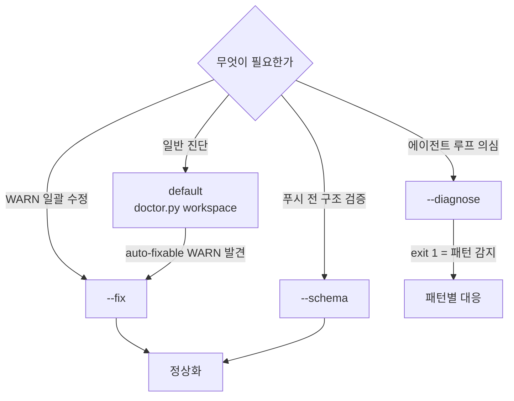

# Doctor 진단·마이그레이션

!!! info "한 줄 요약"
    workspace·team·project 의 정합성을 검사하고, drift·구식 스키마를 감지·자동 수정합니다.

## 언제 쓰나

- 오래된 프로젝트를 **재개** 할 때 (drift 확인)
- 상태가 이상하거나 **부분 설정** 이 의심될 때
- 푸시 전 **플러그인 구조 회귀 검증** 이 필요할 때

doctor 는 각 skill 말미에 자동 실행되지만, 수동 실행도 가능합니다.

## 전제

- 활성 workspace 가 있을 것 (`--schema` 모드는 예외 — 플러그인 구조만 검사)

## 절차

### 모드 선택

doctor 는 4개 모드가 있습니다. 상황에 맞게 고릅니다.



| 모드 | 호출 | 언제 |
|---|---|---|
| default | `/dp-skills:doctor` | 일반 진단 — workspace 구조·`.agent-state.yml`·managed 섹션 |
| `--fix` | `doctor.py workspace --fix` | `auto-fixable` 표시된 WARN/ERROR 일괄 수정 |
| `--schema` | `doctor.py --schema` | 푸시 전 플러그인 구조 회귀 검증 |
| `--diagnose` | `doctor.py workspace --diagnose` | evaluator NOT_READY 2회 연속, 루프·Red 증거 누락 의심 시 |

### 오래된 프로젝트 재개 — drift 대응

```text
/dp-skills:project OldFeature     # 활성화
/dp-skills:doctor                 # drift WARN 확인

# WARN: features 증가 / scope mtime / duplicate section
/dp-skills:analyze --regen-agents
  # 자동 백업 (.agents.bak/{ts}/) + agents/*.md 재생성 + post-check
```

post-check 에서 duplicate 섹션이 발견되면 백업과 비교해 수동 머지합니다.

## 흔한 실수

- **`--schema` 는 푸시 전 로컬에서 직접 돌립니다.** 조직 IP allowlist 로 GitHub Hosted Runner CI 가 막혀 있어, 로컬 검증이 SSOT 입니다.
- `--diagnose` 의 exit 1 은 패턴 감지를 뜻합니다 (`loop`·`red-miss`·`repeat-not-ready`·`scope-violation`). exit 0 은 정상입니다.
- `--fix` 는 whitelist 대상만 수정합니다 (state migrate·구식 template 잔재) — 임의 수정이 아닙니다.

## 다음 단계

- How-to: [기획서로 features 일괄 생성](analyze-docs.md) — `--regen-agents` 로 drift 해소
- Reference: [`/dp-skills:doctor`](../reference/skills/doctor.md) · [`doctor.py`](../reference/tools/doctor.md)
