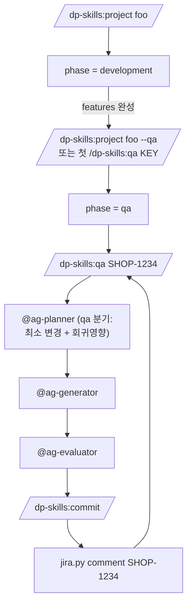

# Plan — QA phase 도입 (project lifecycle 확장)

> status: approved
> created: 2026-05-27
> updated: 2026-05-27 — 미해결 질문 5건 모두 결정 (§12 참조) + 전제 challenge 라운드 (KEY 중복·comment 실패 안전망 2건 추가)
> author: jpseo@jpblog.co.kr
> 관련 메타: project lifecycle · Jira 어댑터 · agents prompt 조건 분기

## 0. 운영 전제

- **여러 project 가 동시에 QA phase 일 수 있다.** 한 turn 은 한 project 만
  활성 (`/dp-skills:project X` 로 명시 전환). `/dp-skills:qa` 는 현재 활성
  project 의 `qa/` 에만 작성한다.
- **다건 추적의 SSOT 는 Jira.** 잔여·우선순위·재오픈 현황은 Jira UI/board
  에서 확인. 본 플러그인은 **건 1개 처리** 에만 책임진다 — 로컬 보드뷰·
  INDEX·진행 요약 카운트 모두 만들지 않는다 (SSOT 이중화 회피).
- `/dp-skills:qa` 는 **인자 필수**. 인자 없이 호출 시 에러 + 사용법 안내.
- **회신은 Jira-only.** `tools/jira.py comment` 가 Jira 에 코멘트 송신하고
  끝. 로컬 `qa/{KEY}.md` 에는 회신 섹션을 두지 않는다 (분석·조치 기록만
  로컬에 남기고, "언제 회신했나" 는 Jira 가 답한다).
- **phase 전환은 명시적.** development ⇄ qa 토글은 `/dp-skills:project X
  --qa` (on) / `--qa off` (development 로 복귀) 로만 가능. 자동 전환 없음.

## 1. 목표·범위

대규모 프로젝트의 features 가 모두 완성된 뒤 QA 팀이 검증을 시작한다.
QA 가 발견한 결함은 Jira 로 보고되며, 개발자는 해당 project 의 **컨텍스트
(features·scope·rules·agents) 를 그대로 이어받아** 수정·회신해야 한다.

현재 `/dp-skills:issue` 는 workspace 독립으로 동작 — project 컨텍스트가
끊겨 QA 처리에 부적합하다. 본 계획은 **project 의 두 번째 phase 로 QA 를
신설**해 컨텍스트 단절 없이 Jira 이슈 1건을 처리하는 사이클을 만든다.

### in scope

- 새 스킬 `/dp-skills:qa {JIRA-KEY}` (활성 project 의 컨텍스트 상속, 인자 필수)
- `.agent-state.yml` 스키마 v1.3 — `phase` 필드 신설
- `tools/jira.py` — `fetch` / `comment` 두 함수 (`confluence.py` 패턴)
- `agents/planner.md` · `agents/generator.md` · `agents/evaluator.md`
  프롬프트에 `phase == qa` 분기 1 블록 추가 (최소 변경 + 회귀영향 분석)
- `/dp-skills:project` 의 `--qa on|off` 플래그 (phase 전환 진입점, 양방향)
- `/dp-skills:create-feature` 진입부 — phase=qa 면 차단 + 안내 ("`--qa off`
  로 development 복귀 후 재시도")
- Jira 키 화이트리스트 — `_common/config.md` 또는 env `JIRA_QA_PROJECT_KEY`
  로 허용 project key 지정 (예: `QAPRJ`). 미일치 시 WARN + confirm
- `/dp-skills:doctor` — phase 정합성 체크 1 룰 추가
- mkdocs 매뉴얼 — explanation / how-to / reference 3 페이지 추가·갱신

### out of scope

- `@ag-qa-*` 별도 에이전트 신설 (기존 agents 가 phase 분기로 충분)
- QA DB (proxysql) 자동 조회 — 운영 데이터 사람 게이트 유지. 접근법만
  `workspace/{TEAM}/context/operations.md` 에 문서화 (팀별 작성, 본
  계획은 템플릿만 제공)
- Jira 상태 자동 전환 (Open → In Progress → Resolved) — 회신 코멘트만
- features → qa 자동 전환 ("완성" 정의 모호 — 명시 진입 원칙)
- 새 lifecycle 모드 (issue·characterize·qa…) 추가 — project 의 sub-phase
- MCP `mcp__atlassian__*` 와 `tools/jira.py` 의 동시 지원 — 하나 선택
  (본 계획은 `tools/jira.py` 채택, MCP 는 §10 대안 참조)
- **로컬 다건 보드/INDEX/카운트** — Jira 가 SSOT, 이중화 금지
- **Jira 다건 조회 (`jira.py list` / JQL wrapper)** — 동시 진행 project 들
  사이에서 보드 의미가 모호해진다. Jira UI 직접 사용
- **project ↔ Jira project 자동 매핑** — 또 다른 설정 축. 필요시 사용자가
  명시적으로 `qa/{KEY}.md` 작성
- **Slack qa 전용 이벤트/채널 분기** — 기존 작업 완료·승인 알림이 phase
  와 무관하게 그대로 동작. qa 전용 추가 이벤트·skip 분기 모두 없음 (즉
  `slack-notify.py` · hooks 모두 변경 없음)
- **로컬 회신 이력** — `qa/{KEY}.md` 에 "회신" 섹션 자체 미포함. 회신
  추적은 Jira 코멘트 이력 사용
- **QA DB (proxysql) 자동 조회·접근법 템플릿** — 팀별 작성. 본 계획
  out of scope

## 2. 모델 — phase ⊥ mode

phase 와 mode 는 **직교** 한다. QA phase 안에서도 TDD 모드가 가능.

| 축 | 값 | 표현 위치 |
|---|---|---|
| **phase** (신규) | `development` (기본) · `qa` | `.agent-state.yml` `phase` |
| **mode** (기존) | `standard` · `tdd` · `characterize` | `.agent-state.yml` `tdd`·`mode` |

phase 는 **작업 단계** (무엇을 하고 있는가), mode 는 **사이클 동작 방식**
(어떻게 진행하는가). agents 는 두 축을 모두 본다.



## 3. 산출물 위치

```
workspace/{TEAM}/projects/{PROJECT}/
├── project.md
├── features/           # development phase 산출물 (불변)
│   └── 01-cart.md
├── agents/             # planner·generator·evaluator (재사용)
├── qa/                 # 신규 — phase=qa 진입 후 생성
│   ├── SHOP-1234.md    # Jira 키 1건 = 파일 1개
│   └── SHOP-1235.md
└── .agent-state.yml    # phase: qa
```

원칙:

- `qa/` 폴더는 `/dp-skills:qa {KEY}` 첫 호출 시 lazy 생성
- 파일명은 Jira 키 그대로 (`^[A-Z]+-\d+$`)
- features/ 는 **읽기 전용** — QA phase 에서 features 본문 수정 금지
  (수정 필요 시 회신 후 별도 development 사이클로 재진입)

## 4. `qa/{JIRA-KEY}.md` 템플릿

`skills/context/lifecycle/projects/example/qa/{JIRA-KEY}.md.example` 로 배치.

```markdown
# {JIRA-KEY} — {요약}

> jira: {URL}
> reported: {YYYY-MM-DD}
> reporter: {QA 담당}

## 현상

_(jira.py fetch 가 prefill)_

## 연관 feature

- features/NN-*.md (grep 또는 사용자 명시)

## 재현 경로

_(Jira 본문에서 추출 또는 사용자 보강)_

## 원인

_(@ag-planner 분석 후 기입)_

## 조치

_(@ag-generator 구현 후 기입 — 변경 파일·핵심 diff 요약)_

## 회귀영향

_(@ag-evaluator 가 채움 — 동일 코드 경로를 쓰는 다른 feature 영향 평가)_
```

> **"회신" 섹션 없음.** 회신은 `jira.py comment {KEY} "..."` 로 Jira 에
> 송신하고 끝낸다. 로컬 파일은 분석·조치·회귀영향 기록만 — 회신 이력의
> SSOT 는 Jira (§0 운영 전제 참조).

## 5. 변경 영향 — 파일·기능 별

| 영역 | 파일 | 변경 |
|---|---|---|
| 신규 스킬 | `skills/qa/SKILL.md` | 신규 (인자 필수) |
| 스킬 갱신 | `skills/project/SKILL.md` | §1 인자 파싱에 `--qa on|off` 추가, §3 STATE.md 갱신에 phase 표시 |
| 스킬 갱신 | `skills/create-feature/SKILL.md` | 진입부에 phase 체크 — `phase=qa` 면 차단 + 안내 후 종료 |
| 스킬 갱신 | `skills/issue/SKILL.md` | 첫 문장에 "QA 결함 처리는 `/dp-skills:qa` 사용" 안내 1줄 |
| State schema | `skills/context/lifecycle/state-schema.md` | v1.3 신설, `phase`·`qa_started_at` 필드 |
| State writer | `tools/migrate-state.py` | v1.2 → v1.3 in-place 업그레이드 (phase=development default) |
| 도구 | `tools/jira.py` | 신규 — `fetch` / `comment` (+ 키 화이트리스트 검증) |
| 설정 | `workspace/{TEAM}/_common/config.md` | `jira_qa_project_key: QAPRJ` 한 줄 (선택, env 와 양자택일) |
| 도구 갱신 | `tools/doctor.py` | phase 가 `qa` 인데 `qa/` 폴더 없거나 빈 경우 INFO, phase=qa 인데 features/ 미존재면 WARN |
| 템플릿 | `skills/context/lifecycle/projects/example/qa/.gitkeep` | 신규 — example 에 빈 폴더 |
| 템플릿 | `skills/context/lifecycle/projects/example/qa/JIRA-KEY.md.example` | 신규 — 4섹션 템플릿 |
| Lifecycle 가이드 | `skills/context/lifecycle/projects/GUIDE.md` | qa/ 섹션 추가 (있을 경우, 없으면 신규 작성 — 사전 확인 필요) |
| Agents | `agents/ag-planner.md` | "phase == qa 시 최소 변경 우선, 회귀영향 후보 명시" 블록 |
| Agents | `agents/ag-generator.md` | "phase == qa 시 신규 추상화 금지, 결함 지점 국소 수정" 블록 |
| Agents | `agents/ag-evaluator.md` | "phase == qa 시 회귀영향 평가 섹션 필수 출력" 블록 |
| Hooks | `hooks/protect-managed.sh` | features/ 보호는 development phase 한정 — phase=qa 에서는 features/ Write 차단 강화 (의도 명시) |
| 문서 | `docs/explanation/modes.md` | "phase 와 mode 의 차이" 절 추가 |
| 문서 | `docs/explanation/lifecycle-phases.md` | 신규 페이지 |
| 문서 | `docs/how-to/qa-cycle.md` | 신규 페이지 |
| 문서 | `docs/reference/skills/qa.md` | 신규 페이지 (docs_build.py 자동 생성 대상) |
| 문서 | `docs/reference/tools/jira.md` | 신규 페이지 (docs_build.py 자동 생성 대상) |
| Nav | `mkdocs.yml` | how-to "운영" 그룹에 qa-cycle, explanation 에 lifecycle-phases 추가 |
| Plugin | `.claude-plugin/plugin.json` | version bump `0.10.0` → `0.11.0` (minor — 신규 스킬·스키마 v1.3) |

## 6. `.agent-state.yml` 스키마 v1.3

```yaml
schema: v1.3
analyzed: true
tdd: false
domain: orders
phase: qa                              # development | qa, default development
qa_started_at: "2026-05-27T00:00:00Z"  # phase 가 qa 로 전환된 시점 (optional)
# ... 기존 필드 유지 ...
```

규칙:

- `phase` 필수 (default `development`) — v1.2 → v1.3 마이그레이션 시 자동 주입
- `phase: qa` 전환은 명시적 (`--qa` 플래그 또는 `/dp-skills:qa` 첫 호출)
- 역방향 전환 (`qa` → `development`) 도 `--qa off` 로 지원 (회귀 sprint 등)
- writers 표에 `/dp-skills:project --qa` · `/dp-skills:qa` 추가

## 7. 단계별 구현 계획

### Step 1 — 스키마·마이그레이션 기반

1. `state-schema.md` v1.3 작성 (`phase`·`qa_started_at` 필드 명세)
2. `migrate-state.py` 에 v1.2 → v1.3 분기 (in-place, `phase: development` 주입)
3. `doctor.py` phase 정합성 룰 추가
4. 테스트 — `tests/tools/test_migrate_state.py` 케이스 추가 (v1.2 파일 입력 → v1.3 출력, phase 필드 존재)

### Step 2 — Jira 어댑터

1. `tools/jira.py` 작성 (`confluence.py` 패턴 미러)
   - `fetch KEY` — Jira REST API v3 `/issue/{key}` 호출, 본문·재현·첨부 메타 stdout
   - `comment KEY "msg"` — `/issue/{key}/comment` POST
   - 환경변수 `JIRA_BASE_URL`·`JIRA_EMAIL`·`JIRA_TOKEN` (CONFLUENCE_* 와 분리 — 토큰 권한 다를 수 있음)
   - **키 화이트리스트 검증** (fetch·comment 공통):
     - 우선순위: `_common/config.md` 의 `jira_qa_project_key` > env `JIRA_QA_PROJECT_KEY` > (미설정)
     - 미설정 → 모든 `^[A-Z]+-\d+$` 허용 (silent)
     - 설정 + 일치 → 통과
     - 설정 + 미일치 → stderr WARN + 진행 확인 (`y/n`). non-interactive (no TTY) 면 fail-safe 로 거절
     - 형식 위배 (`shop1234` 등) → ERROR (env 무관)
   - 미설정 시 명확한 에러 + 설정 안내
   - **`list` 명령은 만들지 않는다** (§0·§1 out of scope) — 다건 조회 Jira UI 책임
   - **comment 실패 처리** — 네트워크·인증·권한·키 부재 어느 사유든 실패 시 stderr 첫 줄에 큰 헤더 (`[ERROR] COMMENT FAILED for {KEY}`) + 다음 줄에 원인 1줄 + non-zero exit. 성공이면 stdout 1줄 `OK` (또는 silent). 사용자가 흘려보내지 않도록 헤더는 항상 stderr first line
2. 테스트 — `tests/tools/test_jira.py` (HTTP mock, 키 형식 검증, 화이트리스트 분기, 환경변수 부재 처리, comment 실패 시 stderr 헤더·exit code)

### Step 3 — 신규 스킬 `/dp-skills:qa`

1. `skills/qa/SKILL.md` 작성
   - P-1 (TodoWrite) · P0 (memory-hint Jira 키 기반) · P1 (TEAM)
   - **인자 검증 (필수)** — `$ARGUMENTS` 비었으면 에러:
     `"Jira 이슈 키가 필요합니다. 예: /dp-skills:qa SHOP-1234"`
   - **인자 형식 검증** — `^[A-Z]+-\d+$` 아니면 에러
   - 활성 project 확인 — STATE.md 의 `| project | X | ... |` 행 없으면 에러
   - phase 확인 — `development` 면 "QA 진입하려면 `/dp-skills:project X --qa`" 안내 후 종료
   - `qa/{KEY}.md` 존재 여부 분기 (신규 생성 vs Read 만)
   - **workspace KEY 중복 검사** (신규 생성 직전) — `find workspace/{TEAM}/projects/*/qa/{KEY}.md` 실행. 다른 project 에 같은 KEY 파일이 이미 있으면 WARN + 기존 경로 안내 + confirm (`y/n`). 같은 결함이 두 project 에 분산되는 것을 막는 1차 방어선. non-interactive (no TTY) 면 fail-safe 로 거절
   - 신규 생성 시 `python3 tools/jira.py fetch {KEY}` → 템플릿 prefill
   - 다음 단계: `@ag-planner` 호출 안내
   - **보드뷰·다건 조회 분기 없음** — Jira 가 SSOT (§0 전제)
2. `skills/context/lifecycle/projects/example/qa/JIRA-KEY.md.example` 작성
3. `skills/context/lifecycle/projects/GUIDE.md` qa/ 섹션 추가

### Step 4 — project 스킬 갱신 + create-feature 가드

1. `skills/project/SKILL.md` §1 인자 파싱에 `--qa on|off` 토큰 추가 (인자 없이 `--qa` = `--qa on` alias)
2. `--qa on` 처리 — phase 를 `qa` 로 전환, `qa_started_at` 기록, features/ 존재 여부 확인 (없으면 WARN)
3. `--qa off` 처리 — phase 를 `development` 로 되돌림 (qa/ 파일은 보존, `qa_started_at` 유지)
4. STATE.md 행 형식 — `| project | foo | QA |` (phase=qa 시) / `| project | foo | 진행중 |` (default). **진행 카운트 등 동적 요약 미포함** (Jira UI 가 SSOT)
5. `skills/create-feature/SKILL.md` 진입부에 phase 체크 — `.agent-state.yml` 의 `phase=qa` 면 다음 메시지 출력 후 종료:
   `"QA phase 중에는 신규 feature 추가가 차단됩니다. development 로 복귀하려면 /dp-skills:project {PROJECT} --qa off 실행 후 재시도하세요."`
6. `skills/issue/SKILL.md` 첫 문장에 안내 1줄 추가

### Step 5 — Agents prompt 분기

1. `agents/ag-planner.md` — 상태 로드 후 `phase == qa` 블록 추가
   - "결함 수정 모드 — 최소 변경 우선. 신규 추상화·리팩터 제안 금지. 회귀영향 후보 파일을 plan 본문에 나열."
2. `agents/ag-generator.md` — 동일 블록
   - "결함 지점 국소 수정. 동일 함수 외 변경 금지. features/ 본문 수정 금지 (hook 가 차단)."
3. `agents/ag-evaluator.md` — 동일 블록
   - "회귀영향 평가 섹션 필수 — 동일 호출 경로를 쓰는 feature 명단과 영향 판단을 reporting 에 포함."

### Step 6 — Hooks

1. `hooks/protect-managed.sh` — phase=qa 일 때 features/ Write 차단 (현재도 일부 차단되지만 phase 인지 추가)
2. 동시에 qa/ 폴더는 쓰기 허용 (default 라 별도 작업 없음 — 명시 주석만)

### Step 7 — Doctor 룰

1. `doctor.py` 신규 룰:
   - phase=qa 인데 features/ 비어있음 → ERROR
   - phase=qa 인데 qa/ 폴더 없음 → INFO (첫 호출 전 가능)
   - schema=v1.2 이하 → migrate 안내 (기존 룰 확장)

### Step 8 — 매뉴얼 (mkdocs)

§9 참조.

### Step 9 — 통합 검증

1. example workspace 에서 시나리오 1 회 수행 — `--qa` 전환 → 가짜 Jira fetch (mock) → planner/generator/evaluator 통과 → comment 송신 mock
2. `python3 tools/doctor.py workspace` PASS
3. `mkdocs serve` 로컬 빌드 후 nav·링크 확인

### Step 10 — 릴리즈

1. `plugin.json` 0.10.0 → 0.11.0
2. CHANGELOG 또는 release.sh 메모 — phase QA 신설
3. README (루트·dp-skills) 짧은 안내 추가

## 8. 마이그레이션 절차 (사용자)

기존 v1.2 프로젝트:

```bash
python3 ${CLAUDE_PLUGIN_ROOT}/tools/migrate-state.py workspace --apply
# → 모든 .agent-state.yml 에 phase: development 자동 주입
```

기존 운영 이슈 처리 흐름 (`/dp-skills:issue`) 은 **그대로 유지**.
project 컨텍스트가 필요 없는 단발 운영 장애 처리 = issue, project 완성 후
QA 결함 = qa. 두 스킬은 공존한다.

## 9. docs 매뉴얼 추가 (mkdocs)

### 9-1. 신규 페이지

| 경로 | 분류 | 내용 |
|---|---|---|
| `docs/explanation/lifecycle-phases.md` | Explanation | phase 와 mode 의 직교 관계, development/qa 의 책임 차이, QA 가 선택적인 이유 |
| `docs/how-to/qa-cycle.md` | How-to | development 종료 → `--qa` 전환 → `/dp-skills:qa KEY` → planner 사이클 → commit → Jira 회신 까지 절차 (코드 블록 포함 5분 분량). **"다건 추적은 Jira UI" 1절 명시** — 본 스킬은 1건 처리 전용, 잔여·우선순위·재오픈 현황은 Jira board 사용 |
| `docs/reference/skills/qa.md` | Reference | `docs_build.py` 가 `skills/qa/SKILL.md` frontmatter 에서 자동 생성 |
| `docs/reference/tools/jira.md` | Reference | `docs_build.py` 가 `tools/jira.py` docstring 에서 자동 생성 |

### 9-2. 갱신 페이지

| 경로 | 변경 |
|---|---|
| `docs/explanation/modes.md` | 상단에 "phase 와 mode 의 차이" 1 절 신설 — QA phase 가 mode 가 아님을 명확히. mermaid 분기 갱신 |
| `docs/explanation/workspace-layout.md` | `qa/` 폴더 위치·역할 1 줄 추가 |
| `docs/how-to/index.md` | 운영 그룹 카드에 qa-cycle 링크 추가 |
| `docs/index.md` | 4 경로 카드 변경 없음 (lifecycle-phases 는 explanation 내부 링크로 접근) |

### 9-3. `mkdocs.yml` nav 변경 diff

```yaml
nav:
  - How-to:
      - 운영:
          - Doctor 진단·마이그레이션: how-to/doctor-diagnose.md
          - Slack 알림 설정: how-to/slack-notify.md
          - QA 사이클 진행: how-to/qa-cycle.md           # 신규
  - Explanation:
      - 모드 - Standard / TDD / Characterize: explanation/modes.md
      - Lifecycle phases - development / qa: explanation/lifecycle-phases.md  # 신규
```

### 9-4. README 갱신

- 루트 `README.md` — 변경 없음 (사이트가 SSOT)
- `dp-skills/README.md` — 스킬 목록 표에 `qa` 1행, lifecycle 절에 phase 개념 1문단 추가

## 10. 대안 — Atlassian MCP 채택 시 차이

`tools/jira.py` 대신 `mcp__atlassian__*` MCP 를 쓰는 길:

| 항목 | tools/jira.py (채택) | atlassian MCP (대안) |
|---|---|---|
| 일관성 | `confluence.py` 와 동형 — 진입점·env·에러 메시지 통일 | 별도 인증 흐름 (`mcp__atlassian__authenticate`) |
| 디버깅 | stdout 명령으로 직접 실행 가능 | MCP 컨텍스트 의존 |
| 의존성 | stdlib 만 | 외부 MCP 서버 |
| 보안 | env 토큰 | MCP 인증 토큰 |
| 결정 | **채택** | future work (MCP 채택 시 jira.py 는 thin wrapper 로 변경 가능) |

## 11. 검증 체크리스트

- [ ] `/dp-skills:qa` 인자 없으면 에러 (보드뷰 진입 없음)
- [ ] `/dp-skills:qa` KEY 형식 위배 시 에러
- [ ] 활성 project 가 동시에 여러 개 있어도 현재 turn 의 활성 project `qa/` 에만 작성됨 (다른 project `qa/` 무영향)
- [ ] 같은 KEY 가 다른 project 에 이미 존재 시 신규 생성 직전 WARN + confirm
- [ ] `jira.py comment` 실패 시 stderr 첫 줄 `[ERROR] COMMENT FAILED` 헤더, non-zero exit
- [ ] `migrate-state.py` v1.2 → v1.3 idempotent (재실행해도 변화 없음)
- [ ] `phase=qa` 인 project 에서 features/ Write 시 hook 가 차단
- [ ] `/dp-skills:qa` 가 활성 project 없을 때 명확한 에러 출력
- [ ] `/dp-skills:qa` 가 phase=development 일 때 전환 안내 출력 (자동 전환 X)
- [ ] `tools/jira.py fetch` 가 환경변수 부재 시 명확한 에러 + 설정 안내
- [ ] agents (planner/generator/evaluator) 가 phase=qa 분기에서 회귀영향 섹션을 산출
- [ ] `mkdocs build` 경고 0
- [ ] `doctor.py` 가 phase=qa + features/ 부재 시 ERROR
- [ ] 기존 issue 모드 동작 변경 없음 (회귀 테스트)

## 12. 결정 사항 (2026-05-27 closed)

| # | 질문 | 결정 | 반영 위치 |
|---|---|---|---|
| 1 | `phase=qa` 에서 `/dp-skills:create-feature` 허용 여부 | **차단.** phase 전환 (`--qa off`) 후에만 허용 | §1 in scope, Step 4-5, §5 표 |
| 2 | phase 전환 명령 형식 | `/dp-skills:project {PROJECT} --qa on\|off` (인자 없이 `--qa` = on alias) | §0, §1, Step 4-1·2·3 |
| 3 | Jira 키 형식 검증 | `_common/config.md` 의 `jira_qa_project_key` 또는 env `JIRA_QA_PROJECT_KEY` 화이트리스트. 미일치 시 WARN + confirm, 형식 위배는 ERROR | Step 2-1, §5 표 |
| 4 | `qa/{KEY}.md` 회신 섹션 처리 | **섹션 자체 제거.** 회신은 Jira-only — `jira.py comment` 로 송신하고 끝 | §0, §4 템플릿 |
| 5 | Slack qa 이벤트 추가 분기 | **추가 작업 없음.** 기존 작업 완료·승인 알림이 phase 무관하게 그대로 동작 | §1 out of scope |
| 6 | QA DB operations.md 템플릿 | **out of scope.** 팀별 작성 | §1 out of scope |

## 13. 작업 추정 (참고)

- Step 1 (스키마·migrate): 0.5 일
- Step 2 (jira.py): 0.5 일
- Step 3 (qa 스킬): 1 일
- Step 4 (project 갱신): 0.5 일
- Step 5 (agents 분기): 0.5 일
- Step 6 (hooks): 0.5 일
- Step 7 (doctor): 0.5 일
- Step 8 (매뉴얼): 1 일
- Step 9 (통합 검증): 0.5 일
- Step 10 (릴리즈): 0.5 일

총 ~5.5 일. Step 1·2 병렬 가능. Step 5 는 1·3 완료 후.
